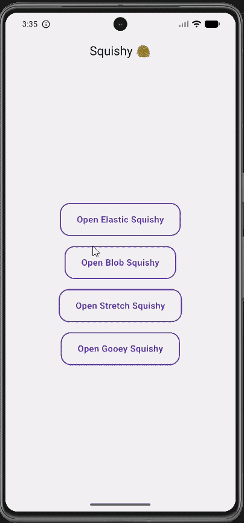

# 🫠 Squishy

> Beautiful organic page transitions for Flutter.
> Make navigation feel alive with blob, gooey, elastic and stretch animations.

✨ Why Squishy?

Flutter apps often use the same default page transitions.
Squishy brings playful motion, organic animations, and fluid navigation experiences that instantly make your app feel more modern.
Perfect for:

Creative apps
Portfolio apps
Startup products
Social apps
Modern dashboards
Premium UI experiences

## 🎬 Preview

<p>
  
</p>

---

## ✨ Features

- 🚀 Smooth page transitions
- 🫠 Organic blob animations
- 🔥 Gooey liquid effects
- ✨ Elastic bounce transitions
- 🧩 Stretch/rubber reveal
- ⚡ Lightweight & easy to use
- 🎨 Modern transition showcase
- 📱 Works on Android, iOS, Web & Desktop

# 📦 Installation

Add this to your `pubspec.yaml`

```yaml
dependencies:
  squishy: ^0.0.2
```

Then run:

```bash
flutter pub get
```

---

# 🚀 Usage

Import package:

```dart
import 'package:squishy/squishy.dart';
```

---

# ✨ Elastic Transition

```dart
Navigator.of(context).push(
  SquishyPageRoute(
    page: const NextScreen(),
    effect: SquishyEffect.elastic,
  ),
);
```

---

# 🫠 Blob Transition

```dart
Navigator.of(context).push(
  SquishyPageRoute(
    page: const NextScreen(),
    effect: SquishyEffect.blob,
  ),
  
);
```

---

# 🚀 Stretch Transition

```dart
Navigator.of(context).push(
  SquishyPageRoute(
    page: const NextScreen(),
    effect: SquishyEffect.stretch,
  ),
);
```

---

# 🔥 Gooey Transition

```dart
Navigator.of(context).push(
  SquishyPageRoute(
    page: const NextScreen(),
    effect: SquishyEffect.gooey,
  ),
);
```

---

# 🎨 Available Effects

```dart
SquishyEffect.elastic
SquishyEffect.blob
SquishyEffect.stretch
SquishyEffect.gooey
```

---

# 🧠 Example

```dart
Navigator.push(
  context,
  SquishyPageRoute(
    page: const HomeScreen(),
    effect: SquishyEffect.blob,
  ),
);
```

---

# 🌟 Why Squishy?

Squishy is designed to make Flutter navigation feel:

- smoother
- more playful
- modern
- interactive
- visually satisfying

Instead of boring default transitions, Squishy gives your app personality.

---

# 📱 Platform Support

| Platform | Supported |
| -------- | --------- |
| Android  | ✅        |
| iOS      | ✅        |
| Web      | ✅        |
| macOS    | ✅        |
| Windows  | ✅        |
| Linux    | ✅        |

---

# 🔮 Upcoming Effects

- 🌊 Wave
- 🖤 Ink
- 💫 Morph
- 🌈 Liquid Swipe
- 🧪 Advanced Goo Physics

---

# 🤝 Contributing

Pull requests are welcome.
Feel free to improve animations, performance, and effects.

---

# 📄 License

MIT License © 2026

---

# 💙 Show Some Love

If you like this package, give it a ⭐ on GitHub and support the project 🚀

## 🌐 GitHub

⭐ Star the project on GitHub:

[Squishy GitHub Repository](https://github.com/Sakshi-2508/squishy)

# Package URL
https://pub.dev/packages/squishy
